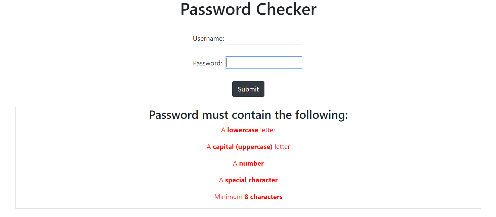
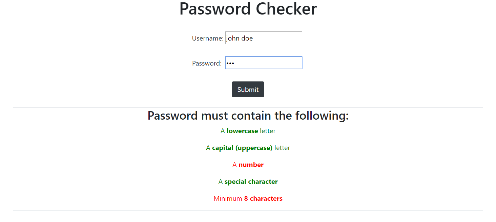
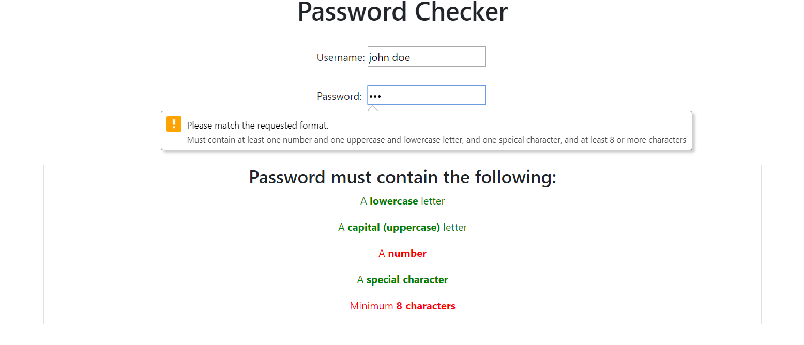
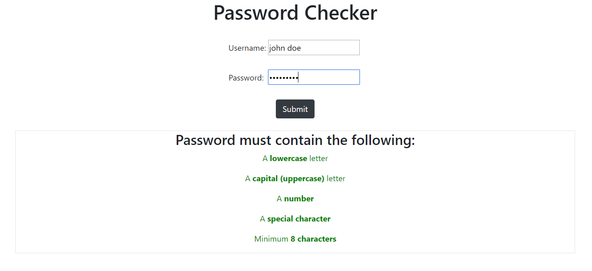

# Password-Checker
### Simple password checker that requires users to have:  
1. one uppercase letter  
2. one lowercase letter  
3. one number  
4. one special letter  
5. password length >= 8.

---

## If nothing match

## If something match

## If submit but not all match

## If all match

---